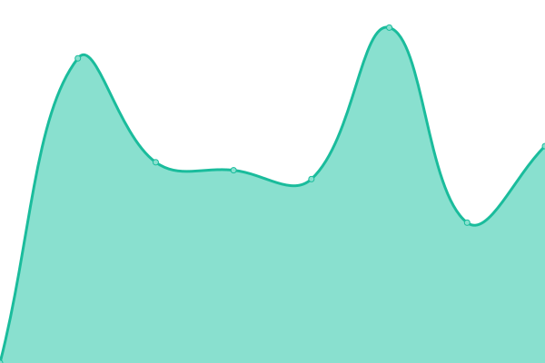

# [📈 Live Status](https://andreesg.github.io/intk-upptime): <!--live status--> **🟩 All systems operational**

This repository contains the open-source uptime monitor and status page for [INTK](https://www.intk.com) projects, powered by [Upptime](https://github.com/upptime/upptime).

With [Upptime](https://upptime.js.org), you can get your own unlimited and free uptime monitor and status page, powered entirely by a GitHub repository. We use [Issues](https://github.com/andreesg/intk-upptime/issues) as incident reports, [Actions](https://github.com/andreesg/intk-upptime/actions) as uptime monitors, and [Pages](https://andreesg.github.io/intk-upptime) for the status page.

<!--start: status pages-->
<!-- This summary is generated by Upptime (https://github.com/upptime/upptime) -->
<!-- Do not edit this manually, your changes will be overwritten -->
<!-- prettier-ignore -->
| URL | Status | History | Response Time | Uptime |
| --- | ------ | ------- | ------------- | ------ |
|  [Haags Historisch Museum](https://www.haagshistorischmuseum.nl) | 🟩 Up | [haags-historisch-museum.yml](https://github.com/intk/intk-upptime/commits/HEAD/history/haags-historisch-museum.yml) | 

 2549ms
     
 | 

<a href="https://intk.github.io/intk-upptime/history/haags-historisch-museum">100.00%</a>
    

|  [Bonnefanten](https://www.bonnefanten.nl) | 🟩 Up | [bonnefanten.yml](https://github.com/intk/intk-upptime/commits/HEAD/history/bonnefanten.yml) | 

 2848ms
     
 | 

<a href="https://intk.github.io/intk-upptime/history/bonnefanten">98.71%</a>
    

|  [De Gevangenpoort](https://www.gevangenpoort.nl) | 🟩 Up | [de-gevangenpoort.yml](https://github.com/intk/intk-upptime/commits/HEAD/history/de-gevangenpoort.yml) | 

 2409ms
     
 | 

<a href="https://intk.github.io/intk-upptime/history/de-gevangenpoort">100.00%</a>
    

|  [Cuypershuis](https://www.cuypershuis.nl) | 🟩 Up | [cuypershuis.yml](https://github.com/intk/intk-upptime/commits/HEAD/history/cuypershuis.yml) | 

 1717ms
     
 | 

<a href="https://intk.github.io/intk-upptime/history/cuypershuis">100.00%</a>
    

|  [Historiehuis](https://www.historiehuis.nl) | 🟩 Up | [historiehuis.yml](https://github.com/intk/intk-upptime/commits/HEAD/history/historiehuis.yml) | 

 2405ms
     
 | 

<a href="https://intk.github.io/intk-upptime/history/historiehuis">100.00%</a>
    

|  [Archief Roermond](https://www.archiefroermond.nl) | 🟩 Up | [archief-roermond.yml](https://github.com/intk/intk-upptime/commits/HEAD/history/archief-roermond.yml) | 

 1448ms
     
 | 

<a href="https://intk.github.io/intk-upptime/history/archief-roermond">99.68%</a>
    

|  [Veenkoloniaal Museum](https://www.veenkoloniaalmuseum.nl) | 🟩 Up | [veenkoloniaal-museum.yml](https://github.com/intk/intk-upptime/commits/HEAD/history/veenkoloniaal-museum.yml) | 

 1449ms
     
 | 

<a href="https://intk.github.io/intk-upptime/history/veenkoloniaal-museum">100.00%</a>
    

|  [Zeeuws Museum](https://www.zeeuwsmuseum.nl) | 🟩 Up | [zeeuws-museum.yml](https://github.com/intk/intk-upptime/commits/HEAD/history/zeeuws-museum.yml) | 

 2430ms
     
 | 

<a href="https://intk.github.io/intk-upptime/history/zeeuws-museum">100.00%</a>
    

|  [Zeeuws Museum Jaarverslag](http://jaarverslag.zeeuwsmuseum.nl) | 🟩 Up | [zeeuws-museum-jaarverslag.yml](https://github.com/intk/intk-upptime/commits/HEAD/history/zeeuws-museum-jaarverslag.yml) | 

 1036ms
     
 | 

<a href="https://intk.github.io/intk-upptime/history/zeeuws-museum-jaarverslag">100.00%</a>
    

|  [Het Markiezenhof](https://www.markiezenhof.nl) | 🟩 Up | [het-markiezenhof.yml](https://github.com/intk/intk-upptime/commits/HEAD/history/het-markiezenhof.yml) | 

 1176ms
     
 | 

<a href="https://intk.github.io/intk-upptime/history/het-markiezenhof">99.79%</a>
    

|  [INTK](https://www.intk.com/en) | 🟩 Up | [intk.yml](https://github.com/intk/intk-upptime/commits/HEAD/history/intk.yml) | 

 1017ms
     
 | 

<a href="https://intk.github.io/intk-upptime/history/intk">94.52%</a>
    

|  [New Zeeuws Museum](https://new.zeeuwsmuseum.nl/nl/over-het-museum/publicaties/) | 🟩 Up | [new-zeeuws-museum.yml](https://github.com/intk/intk-upptime/commits/HEAD/history/new-zeeuws-museum.yml) | 

 1556ms
     
 | 

<a href="https://intk.github.io/intk-upptime/history/new-zeeuws-museum">100.00%</a>
    

<!--end: status pages-->

[**Visit our status website →**](https://andreesg.github.io/intk-upptime)

## 📄 License

- Powered by: [Upptime](https://github.com/upptime/upptime)
- Code: [MIT](./LICENSE) © [André Gonçalves](https://www.goncalves.me)
- Data in the `./history` directory: [Open Database License](https://opendatacommons.org/licenses/odbl/1-0/)
